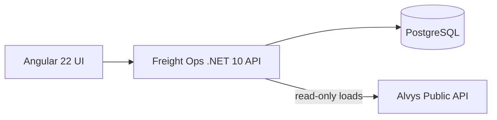

# Architecture



## Boundary

Freight Ops owns customer/account workflow and commercial prioritization. It consumes external load visibility but never treats the third-party transport system as its own database.

It is a companion to [ltl-planner](https://github.com/poker-kid-100717/ltl-planner) and [yard-ops](https://github.com/poker-kid-100717/yard-ops), covering the customer side of the same freight workflow. It shares no code, storage, or runtime dependency with either; each application deploys and runs on its own.

## Data model

Reps, customers (accounts), contacts, activities, follow-ups, quotes, leads, lanes and carriers, in one EF Core context (`api/Data`). Migrations target PostgreSQL and are applied by the deploy pipeline (`dotnet Portfolio.Freight.Api.dll migrate`, run as the schema owner over a direct connection) before the new container starts; the running app connects through the pooler as a role that can only read and write rows, and reports not-ready if the schema is behind its build. Local runs and Compose still migrate on startup (`Database:MigrateOnStartup`). With no `DATABASE_URL`, the API creates a throwaway SQLite database from the same model so the demo still runs; decimals are stored as REAL there because SQLite cannot sort or sum them.

Seed data is fictional, dated relative to "now", and loaded only into an empty database. Seeded records have stable ids, so links survive the daily reset.

## Rules

- Quotes: Draft → Sent → Won or Lost; a draft can be lost; only drafts can be edited. Each move is logged on the account timeline. A prospect's first win makes it Active.
- Leads: only Qualified leads convert. Conversion creates the account, its primary contact and a timeline note in one transaction; converted leads are read-only.
- Contacts: exactly one primary contact per account.
- Account names and carrier MC numbers are unique; quotes can only use active carriers and the account's own lanes.
- "Days since last touch" is computed from the latest activity, never stored.

## Opportunity scoring

`OpportunityScorer` ranks accounts by days since last touch, monthly load volume, gross margin, account stage and overdue follow-ups, each capped so no single factor dominates. Every account gets a plain-language reason and a suggested next action. The formula is intentionally simple and portfolio-only.

## API

All lists accept `page` and `pageSize` (max 100) and return `{ items, total, page, pageSize }`.

- Home: `GET /api/dashboard`, `GET /api/my-day?rep=`, `GET /api/opportunities`, `GET /api/search?q=`
- Accounts: `GET|POST /api/customers`, `GET|PUT /api/customers/{id}`, `POST /api/customers/{id}/contacts|activities|follow-ups|lanes`
- `GET /api/contacts`, `PUT /api/contacts/{id}`, `GET /api/activities`, `GET /api/follow-ups`, `POST /api/follow-ups/{id}/complete`
- `GET /api/lanes`, `PUT|DELETE /api/lanes/{id}`
- Sales: `GET|POST /api/leads`, `GET|PUT /api/leads/{id}`, `POST /api/leads/{id}/convert`; `GET|POST /api/quotes`, `GET|PUT /api/quotes/{id}`, `POST /api/quotes/{id}/send|win|lose`
- `GET|POST /api/carriers`, `GET|PUT /api/carriers/{id}`, `GET /api/reps`
- `GET /api/reports/{revenue-by-customer|quotes-by-month|activity-by-rep|stage-distribution}` (`?format=csv` for a download)
- `GET /api/meta` (reference lists, storage mode), `GET /api/loads`, `GET /api/integrations/alvys/status`
- `GET /health` (liveness), `GET /health/ready` (database)

## Public demo safeguards

Anyone can edit the deployed demo, so writes are rate-limited per client IP (30 per minute, using Cloudflare's `CF-Connecting-IP`), request bodies are capped at 64 KB, and a Worker cron trigger calls `POST /api/admin/reset-demo` daily with a secret token compared in constant time. If the database is unreachable the API still starts: `/health/ready` reports it, data endpoints answer 503, and it retries at most every 30 seconds.

## Failure behavior

- External Alvys calls have bounded timeouts/resilience and surface degraded state instead of fabricating data.
- Credentials and bearer tokens stay server-side; the Angular app never receives them.

## Cloudflare topology

```text
        Cloudflare edge
              |
   <APP_HOST> or freight-ops.<account>.workers.dev
              |
     Worker + Angular assets
              |  /api/*, /health
              v
     Freight .NET 10 Container  ----->  PostgreSQL (Neon, DATABASE_URL)
```

The container sleeps after 10 minutes without traffic; all state lives in PostgreSQL, so nothing is lost.
