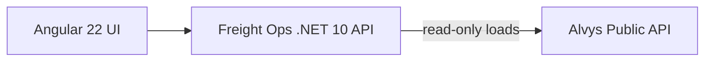

# Architecture



## Boundary

Freight Ops owns customer/account workflow and commercial prioritization. It consumes external load visibility but never treats the third-party transport system as its own database.

It is a companion to [ltl-planner](https://github.com/poker-kid-100717/ltl-planner) and [yard-ops](https://github.com/poker-kid-100717/yard-ops), covering the customer side of the same freight workflow. It shares no code, storage, or runtime dependency with either; each application deploys and runs on its own.

## Opportunity scoring

`OpportunityScorer` ranks accounts by days since last touch, monthly load volume, gross margin, and account stage, each capped so no single factor dominates. Every opportunity carries a plain-language reason and a suggested next action. The formula is intentionally simple and portfolio-only.

## API

- `GET /api/dashboard`: account counts, monthly loads and margin, follow-ups due, and the top five opportunities
- `GET /api/customers`: accounts with their priority score
- `GET /api/opportunities`: all accounts scored and ranked
- `GET /api/loads`: external load visibility (synthetic in demo mode, Alvys Loads Search in live mode)
- `GET /api/integrations/alvys/status`: which mode the adapter is in

## Failure behavior

- External Alvys calls have bounded timeouts/resilience and surface degraded state instead of fabricating data.
- Credentials and bearer tokens stay server-side; the Angular app never receives them.

## Cloudflare topology

```text
        Cloudflare edge
              |
   <APP_HOST> or freight-ops.<account>.workers.dev
              |
     Worker + Angular assets
              |  /api/*, /health
              v
     Freight .NET 10 Container
```

State is in-memory in this portfolio build so the demo is self-contained; the store boundaries are where a database would plug in.
